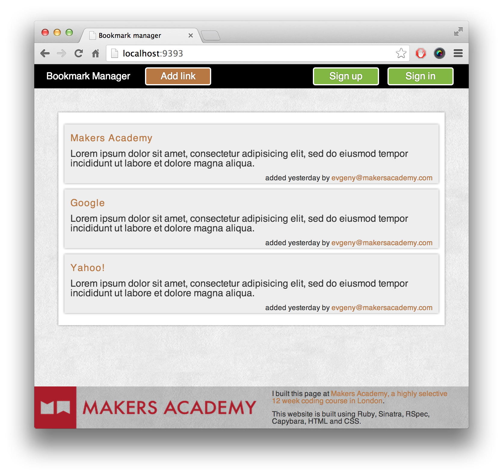

README

* Bookmark Manager

A basic bookmark manager that uses PostgreSQL databases to store and return bookmarks.

**Set up local databases before running (commands in db/migrations)**

* Features

## Show a list of bookmarks:

**User story:**
As a user,
To choose from my bookmarks,
I want to be able to see my bookmarks.

DOMAIN MODEL:

Class: Bookmark
method: all
attributes: name, URL

## Add new bookmarks:

**User story:**
As a user
So I may update my bookmarks
I would like to be able to add bookmarks

## Delete bookmarks
As a user
So I may remove unwanted bookmarks
I would like to be able to delete bookmarks

Update bookmarks
Comment on bookmarks
Tag bookmarks into categories
Filter bookmarks by tag
Users are restricted to manage only their own bookmarks

## Update bookmarks
As a user
So I can update my bookmarks
I would like to select and edit my bookmarks
